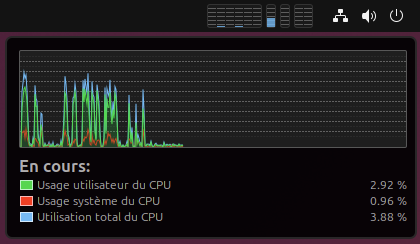
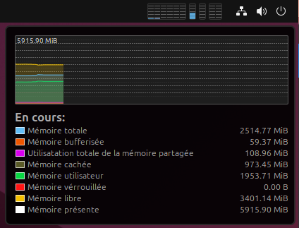
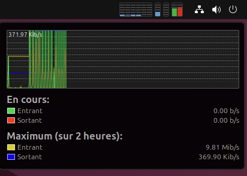

# Gnome-Stats-Pro2

Gnome-Stats-Pro2 is a full rewrite and port to Gnome version 46 and 47 of the [unmaintened gnome-stats-pro extension](https://github.com/tpenguin/gnome-stats-pro) from Thralling Penguin .

## As the original

Miss programs only available on the Mac? So do we. Here's an extension
for GNOME that brings easy visualization of system resources such as:

-   Per CPU core/processor utilization
-   RAM utilization
-   Swap memory utilization
-   Network utilization

In addition to utilization displayed in the tray, it offers drop down
display of historical utilizations.

<div align="left" style="display: inline-block; width: 100%;  align: center; height: 100%" >
    
    
    
    
</div>

## Requirements

gnome-stats-pro2 use gtop and you need to install the `libgtop` package.

Here is a non-exhaustive list of how to install `libgtop` on some popular Linux distributions:

### Ubuntu/Debian

```bash
sudo apt install gir1.2-gtop-2.0
```

### Fedora

```bash
sudo dnf install libgtop2-devel
```

### Arch / Manjaro

```bash
sudo pacman -Syu libgtop
```

### openSUSE

```bash
sudo zypper install libgtop-devel
```

### NixOS

On NixOS, you may need to add the following to your `configuration.nix`:

```nix
environment.variables = {
    GI_TYPELIB_PATH = "/run/current-system/sw/lib/girepository-1.0";
};
environment.systemPackages = with pkgs; [
    libgtop
];
```

## How to Download

-   [Gnome-Stats-Pro2](https://extensions.gnome.org/extension/1043/gnomestatspro2/) is available on GNOME's Extension Repository.
-   [Gnome-Stats-Pro2](https://github.com/Fred78290/gnome-stats-pro2) is available on GitHub.

## Support

Support is available through the GitHub project page [here](https://github.com/Fred78290/gnome-stats-pro2/issues).

Please note this is a open-source, community project, and thus
no guarantees on response time is implied.

## Contributing

Please use GitHub's merge request feature to submit any fixes and/or
improvements.

## License

**Gnome Stats Pro2** is an open-source project and is licensed under
the GPL version 2 or higher. For more information on how this project
is licensed, see the included `LICENSE.md` file.
